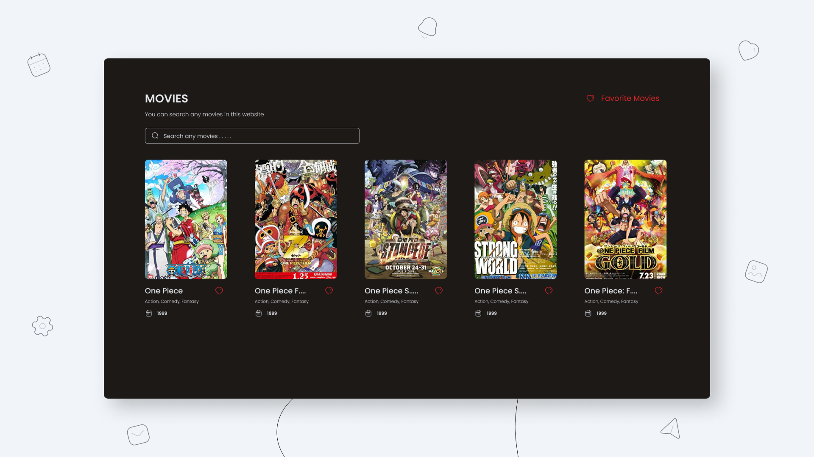

<h3 align="center">MyAnimes frontend</h3>
<p align="center">You can find your favorite movies</p>


### Languages and Tools

- Vue Js
- Vue router
- Tailwindcss
- Pinia
- Axios
- OMDB API
- Google Font
- Iconly
- Vite
- Visual Studio Code

### Clone This Repo

```bash
git clone https://github.com/andikaPs/vue-movie.git
```

- <code>cd vue-movie</code>
- <code>yarn</code>
- <code>yarn dev</code>

# fronted handbook(deng hewen)
root files:
```bash
.
├── README.md
├── index.html # entry point for our web application
├── netlify.toml
├── node_modules
├── package.json
├── postcss.config.js # configure PostCss, which is a tool for processing and transforming CSS styples
├── public
├── src
├── tailwind.config.js
├── vite.config.js
└── yarn.lock
```

src files:
```bash
.
├── App.vue
├── assets
│   ├── banner.png
│   ├── css
│   │   └── index.css
│   ├── logo.png
│   └── no-image.png
├── components
│   ├── Header.vue
│   ├── IsLoading.vue
│   ├── Movie.vue
│   ├── Movies.vue
│   ├── Search.vue
│   └── icons
│       ├── CalendarIcon.vue
│       ├── CloseIcon.vue
│       ├── HeartIcon.vue
│       ├── LocationIcon.vue
│       ├── SearchIcon.vue
│       ├── StarIcon.vue
│       └── TimeIcon.vue
├── main.js
├── router
│   └── index.js
├── store
│   ├── favorit.js
│   └── movies.js
└── views
    ├── Details.vue
    ├── Favorite.vue
    ├── Home.vue
    └── NotFound.vue
```